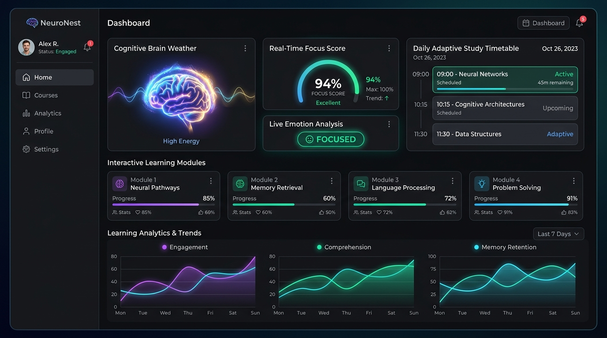
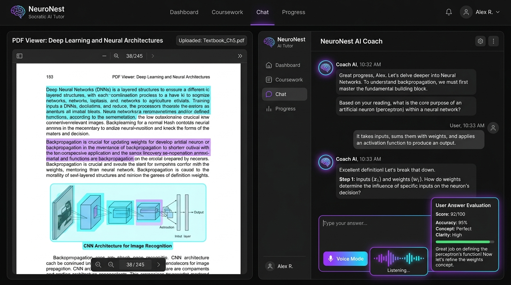
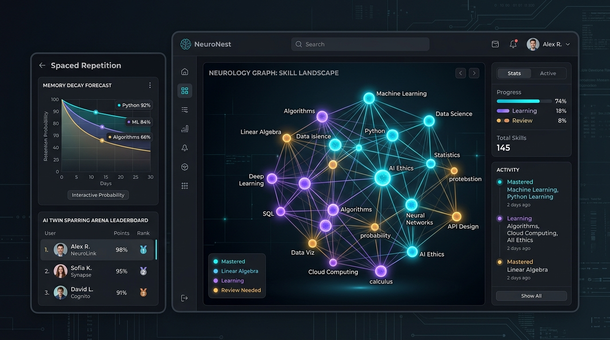
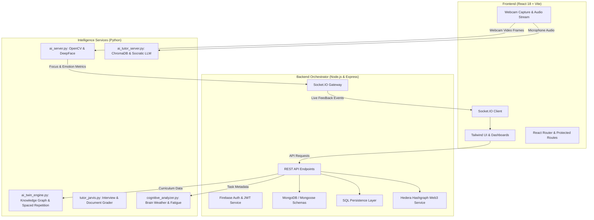

# NeuroNest — Comprehensive Application Documentation

> **NeuroNest** is an intelligent, neuro-adaptive learning and cognitive wellness platform engineered to personalize education based on a student’s real-time mental engagement, memory retention, and emotional state.

---

## 1. Executive Summary

Traditional digital learning platforms treat every learner identically, ignoring cognitive load, attention span, emotional frustration, and mental exhaustion. **NeuroNest** closes this feedback loop by combining non-invasive **Computer Vision**, **Multimodal LLMs**, **Vector-backed RAG**, and **Cognitive Science** into a unified web application.

### Key Pillars:
1. **Real-Time Attentional & Emotional Monitoring**: Non-invasive webcam stream analysis checking engagement, head orientation, and emotional valence.
2. **Socratic AI Tutoring & Document RAG**: Document-grounded coaching using Gemini and ChromaDB that teaches via active inquiry rather than passive answers.
3. **Digital Cognitive Twin**: A personal Knowledge Graph that models memory decay curves, calculates retention probabilities, and structures 7-day adaptive study timetables.
4. **Cognitive Load & Burnout Resilience**: Predictive "Brain Weather" indicators that trigger proactive rest, focus restoration games, or alpha-wave binaural audio sessions.
5. **Gamification & Web3 Certification**: XP progression, badges, streaks, and verifiable achievement credentials recorded on the Hedera Hashgraph network.

---

## 2. Interactive System Dashboards & User Interface

### 2.1 Unified Learning Dashboard & Focus Monitor
The main hub provides learners with immediate visibility into their cognitive state, daily roadmap, and active subject progression.



#### Key Dashboard Capabilities:
* **Cognitive Brain Weather**: Live visualization of mental energy reserves (*High Energy*, *Balanced*, *Fatigue Risk*).
* **Real-Time Focus Score**: Live percentage gauge computed from face presence, blink frequency, and gaze stability.
* **Live Emotion Detection Pill**: Direct feedback from the background vision engine (*Focused*, *Frustrated*, *Neutral*, *Distracted*).
* **Adaptive Timetable**: Dynamically scheduled blocks that adjust based on fatigue levels and upcoming retention deadlines.
* **Longitudinal Trends**: Recharts-powered graphs comparing multi-day engagement, comprehension, and retention.

---

### 2.2 Socratic AI Tutor & Document RAG
The tutoring environment transforms dense textbooks, PDFs, and notes into an interactive, step-by-step masterclass.



#### Tutoring Capabilities:
* **Synchronized PDF Viewer**: Upload any syllabus material or textbook chapter with real-time text chunking.
* **Vector Semantic Search**: High-dimensional embeddings stored in **ChromaDB** ensure answers remain 100% faithful to the source material.
* **Socratic Prompt Engineering**: The tutor prompts the student with progressive questions to verify understanding rather than summarizing prematurely.
* **Live Voice Mode**: Hands-free, low-latency audio interaction powered by Google Gemini Audio streaming.
* **Answer Evaluation Engine**: Quantitative grading (Accuracy, Conceptual Depth, Clarity) with targeted feedback and improvement tips.

---

### 2.3 Digital Cognitive Twin & Knowledge Arena
NeuroNest builds a computational model of the student’s mind to eliminate cramming and optimize long-term retention.



#### Cognitive Twin Capabilities:
* **Interactive 3D Skill Graph**: Visual network mapping dependencies between topics (e.g., Linear Algebra → Deep Learning → Neural Architectures).
* **Dynamic Node Coloring**: Distinct visual states indicate *Mastered*, *Currently Learning*, and *Review Needed (Decay Alert)*.
* **Spaced Repetition Forecasting**: Ebbinghaus forgetting curve modeling predicts the exact day retention drops below 70%, scheduling timely micro-drills.
* **AI Twin Sparring Arena**: Challenge a simulation of your own knowledge base to identify unseen blind spots before real examinations.

---

## 3. High-Level System Architecture



---

## 4. Technical Specifications & Stack

| Layer | Component | Technologies |
| :--- | :--- | :--- |
| **Frontend** | Single Page Application | React 18, Vite, Tailwind CSS, Lucide React, Recharts |
| | Authentication & Audio | Firebase Auth SDK, Web Audio API, Socket.IO Client |
| **Backend** | API Gateway & Orchestrator | Node.js, Express, Socket.IO, Passport.js, PM2 |
| | Database & Persistence | MongoDB (Mongoose), SQL (Dual-DB support), Redis Caching |
| | Web3 & Blockchain | Hedera Hashgraph SDK (HBAR / Token Service) |
| **AI & CV Engine** | Computer Vision | Python 3.10+, OpenCV, Haar Cascades, DeepFace |
| | Large Language Models | Google Gemini 1.5 Pro / Flash, Ollama (Local LLM fallback) |
| | Vector Database & RAG | ChromaDB, Sentence-Transformers |
| | Scientific Computing | NumPy, Pandas, Scikit-learn |

---

## 5. Security & Privacy Guarantees

* **Zero Raw Video Storage**: All webcam frames processed by `ai_server.py` are evaluated strictly in transient memory. No video or webcam photos are saved to disk or transmitted to remote databases.
* **Environment Isolation**: Sensitive configuration keys (Firebase credentials, database connection strings, LLM API keys) are strictly contained within `.env` files and never committed to version control.

---

## 6. Deployment & Getting Started

### Prerequisites
- Node.js v18+ & npm
- Python 3.10+ (with `pip` or `uv`)
- MongoDB instance (local or Atlas)

### Quick Start Commands
```bash
# 1. Clone repository
git clone https://github.com/ayushkunder2005-a11y/neuronest.git
cd neuronest

# 2. Setup Server & Client
npm install
cd client && npm install && cd ..
cd server && npm install && cd ..

# 3. Setup Python AI Engine
cd ai_engine
python -m venv .venv
.\.venv\Scripts\activate
pip install -r requirements.txt
cd ..

# 4. Launch Application Stack
npm run dev
```
